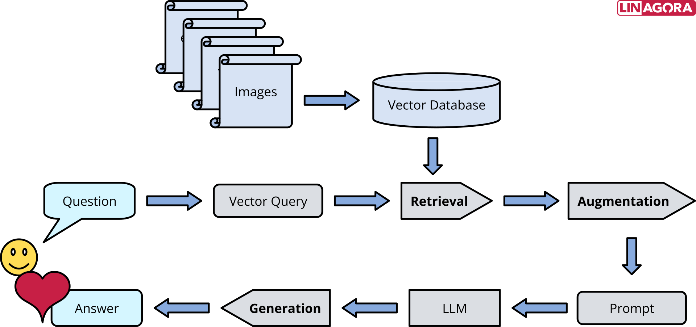

(Due to technical issues, the search service is temporarily unavailable.)

Here's the corrected and fully English version of your README:

# RAGondin 

RAGondin is a project dedicated to experimenting with advanced RAG (Retrieval-Augmented Generation) techniques to improve the quality of such systems. We start with a vanilla implementation and build up to more advanced techniques to address challenges and edge cases in RAG applications.  



## Goals
- Experiment with advanced RAG techniques
- Develop evaluation metrics for RAG applications
- Collaborate with the community to innovate and push the boundaries of RAG applications

## Current Features
- **Supported File Formats**  
The current branch handles the following file types: `pdf`, `docx`, `doc`, `odt`, `pptx`, `ppt`, `txt`. Other formats (csv, html, etc.) will be added in future releases.

- **Chunking**  
Differents chunking strategies are implemented: **`semantic` and `recursive` chunking**.
Currently **semantic chunker** is used to process all supported file types. Future releases will implement format-specific chunkers (e.g., specialized CSV chunking, Markdown chunker, etc).

- **Indexing & Search**  
After chunking, data is indexed in a **Qdrant** vector database using the multilingual embedding model `HIT-TMG/KaLM-embedding-multilingual-mini-v1` (ranked highly on the MTEB benchmark). The same model embeds user queries for semantic search (Dense Search).  
    * **Hybrid Search**: Combines **`semantic search`** with keyword search (using **`BM25`**) to handle domain-specific jargon and coded product names that might not exist in the embedding model's training data.

- **Retriever**  
Supports three retrieval modes:  
    * **Single Retriever**: Standard query-based document retrieval  
    * **MultiQuery**: Generates augmented query variations using an LLM, then combines results  
    * **HyDE**: Generates a hypothetical answer using an LLM, then retrieves documents matching this answer  

- **Grader**: Filters out irrelevant documents after retrieval.  
- **Reranker**: Uses a multilingual reranking model to reorder documents by relevance with respect to the user's query. This part is important because the retriever returns documents that are semantically similar to the query. However, similarity is not synonymous with relevance, so rerankers are essential for reordering documents and filtering out less relevant ones. This helps reduce hallucination.

- **RAG Types**:  
    * **SimpleRAG**: Basic implementation without chat history  
    * **ChatBotRAG**: Version that maintains conversation context  

## Configurations
- `.env`: Stores your LLM API key (`API_KEY`)  and your `BASE_URL` see the **`.env.example`**

## Usage

#### 1. Clone the repository:
```bash
git clone https://github.com/OpenLLM-France/RAGondin.git
git checkout main
```

#### 2. Create poetry environment and install dependencies:
Requirements: Python3.12 and poetry installed

```bash
# Create a new environment using Poetry
poetry config virtualenvs.in-project true

# Install dependencies
poetry install
```

#### 3. Run the fastapi
1. **Prepare Qdrant collection** (using `manage_collection.py`):
> Before running the script, add the files you want to test the rag on the `./data` folder.

```bash
# Create/update collection (default collection from .hydra_config/config.yaml)
python3 manage_collection.py -f './data' 

# Specify collection name
python3 manage_collection.py -f './data' -o vectordb.collection_name={collection_name}
```
See the **`.hydra_config/config.yaml`**. More parameters can be modified using CLI.
For example, to deactivate the contextualized chunking, then you can use the following command
```bash
./manage_collection.py -f ./data/ -o vectordb.collection_name={collection_name} -o chunker.contextual_retrieval=false
```

To delete a vector db, you can the following command
```bash
# Delete collection
python3 manage_collection.py -d {collection_name}
```

2. **Launch the app and the api**:
```bash
# launch the api
uvicorn api:app --reload --port 8082 --host 0.0.0.0
```

You can access the default frontend to chat with your documents. Navivate to the **'/chainlit'** route.

## Contribute
Contributions are welcome! Please follow standard GitHub workflow:
1. Fork the repository
2. Create a feature branch
3. Submit a pull request

## Disclaimer
This repository is for research and educational purposes only. While we strive for correctness, we cannot guarantee fitness for any particular purpose. Use at your own risk.

## License
MIT License - See [LICENSE](LICENSE) file for details.
```